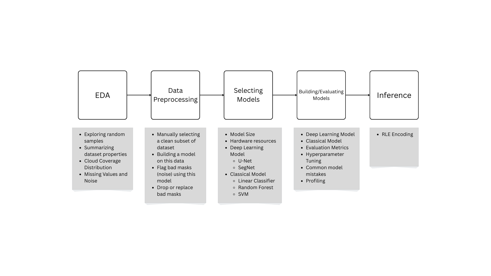

# AI-Powered Cloud Masking Project
In this project, we implemented a complete machine learning pipeline that takes satellite images as input, identifies clouds, and generates a cloud mask as its output.  
This helps in solving the cloud obstruction issue in optical satellite imagery, as identified clouds can be removed, ensuring clearer and more usable images for analysis.

## Requirements

Firstly, clone the repo using
```bash
git clone https://github.com/Elkapeer/AI-Powered-Cloud-Masking.git
cd AI-Powered-Cloud-Masking
```
Then, install required packages and libraries, it can be found in `requirements.txt`. You can install them using 
```bash
pip install -r requirements.txt
```

Also, install dataset from this [Google Drive Link](https://drive.google.com/file/d/1-cU2qx7XY_lwCC7PKOnnNRkeyRto80gC/view), and rename folder to `dataset`.

For GPU acceleration, ensure that CUDA-compatible [PyTorch CUDA 12.8](https://pytorch.org/get-started/locally/) is installed.

Make sure to have python 3.10+ installed.

## Project Structure
```
PROJECT/
├── dataset/                      # Our dataset
├── dataset_filter/               # Text files to filter dataset (eg. noise, clean, missing)
├── evaluation/                   # Model evaluation scripts and metrics
├── models/                       # Saved models
├── thresholds/                   # Thresholds used for our models
│
├── dataset_summary.csv           # Statistical summary of dataset
├── DL.ipynb                      # Building Deep learning model notebook
├── EDA_Preprocessing.ipynb       # Exploratory data analysis and preprocessing
├── ML.ipynb                      # Building Classical model notebook
├── model_logs.txt                # Model size and number of operations
├── profiler.py                   # Code for model profiling
├── Team_6.pdf                    # Project report
├── run_inference.py              # Run inference using a trained model
├── sandbox.ipynb                 # Experimental code and trials
├── ST-Project.pdf                # Project document
├── unet.py                       # U-Net model architecture
├── utilities.py                  # Helper functions
```

## Project Pipeline



## Running The Project

### Testing Model

```bash
python3 run_inference.py <test_folder_path> <model_path>
```
Example
```bash
python3 .\run_inference.py test/test/data .\models\instance_norm_e3.pkl
```

### Profiling

```bash
python profiler.py <model_path> <input_tensor_shape>
```
Example
```bash
python3 .\profiler.py \models\instance_norm_e3.pkl 1 4 512 512
```

## Report

You can find the final report [here](Team_6.pdf)
